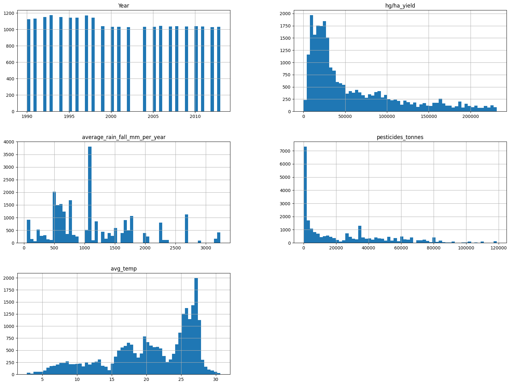
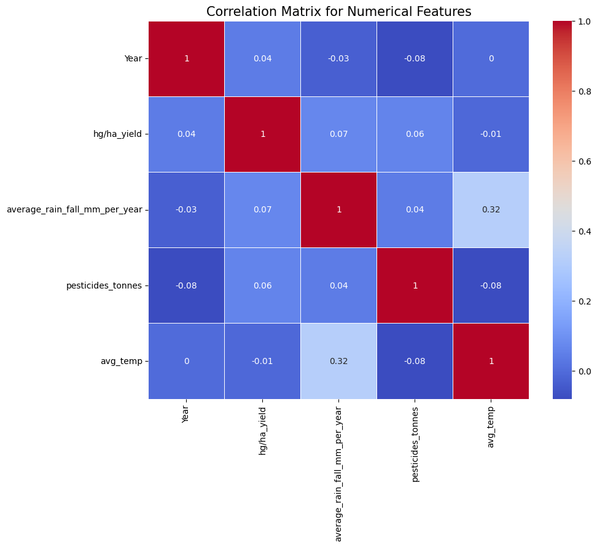

## Domain Proyek

Pertanian merupakan sektor fundamental dalam menopang kebutuhan hidup manusia, terutama dalam penyediaan bahan pangan dan bahan baku industri [[1]](https://doi.org/10.3390/agriculture10060200). Di banyak negara, khususnya negara berkembang, pertanian juga menjadi sumber utama pendapatan masyarakat dan berperan penting dalam menjaga stabilitas ekonomi nasional [[2]](https://scindeks-clanci.ceon.rs/data/pdf/0352-3462/2019/0352-34621904091U.pdf), [[3]](https://doi.org/10.3390/su12083261). Oleh karena itu, produktivitas pertanian menjadi faktor yang sangat krusial dalam mendukung ketahanan pangan dan pembangunan berkelanjutan.

Namun, hasil panen tidak selalu stabil dari tahun ke tahun. Perubahan kondisi lingkungan, seperti curah hujan, suhu udara, serta penggunaan pestisida, dapat memengaruhi hasil produksi pertanian [[4]](https://doi.org/10.3390/ijerph18031112). Ketidakpastian akibat variasi faktor-faktor ini sering menjadi kendala utama dalam pengelolaan lahan dan perencanaan pertanian yang efektif. Dampaknya tidak hanya dirasakan oleh petani secara langsung, tetapi juga pada rantai pasok pangan secara keseluruhan.

Kemajuan teknologi dalam bidang analisis data dan kecerdasan buatan kini membuka peluang untuk mengatasi tantangan tersebut. Salah satu pendekatan yang banyak dikembangkan adalah penerapan machine learning untuk memprediksi hasil panen berdasarkan data historis dan faktor lingkungan [[5]](https://doi.org/10.3390/computers12010010). Dengan membangun model prediktif yang andal, informasi seperti rata-rata curah hujan tahunan, suhu udara, serta penggunaan pestisida dapat dianalisis untuk memperkirakan hasil produksi secara lebih akurat [[6]](https://doi.org/10.1109/ICCV51070.2023.00531). Hasil prediksi ini dapat digunakan oleh petani, peneliti, maupun pembuat kebijakan sebagai dasar dalam pengambilan keputusan strategis yang lebih tepat sasaran dan adaptif terhadap perubahan kondisi lingkungan.

### Mengapa dan Bagaimana Masalah Ini Harus Diselesaikan

Fluktuasi hasil panen merupakan masalah krusial dalam sektor pertanian yang berdampak langsung terhadap **ketahanan pangan**, **kesejahteraan petani**, serta **stabilitas ekonomi** negara, terutama negara yang sangat bergantung pada agrikultur [[7]](https://link.springer.com/article/10.1007/s10584-022-03306-1). Ketidakmampuan untuk memprediksi hasil panen secara akurat dapat menyebabkan:
- **Kelebihan atau kekurangan suplai**, yang mempengaruhi harga pangan.
- **Perencanaan distribusi yang buruk**, yang dapat menyebabkan kerugian bagi petani dan konsumen.
- **Kesalahan strategi kebijakan pangan nasional**, seperti subsidi, ekspor-impor, dan distribusi bantuan.

Oleh karena itu, penerapan machine learning menjadi salah satu pendekatan yang menjanjikan, mengingat kemampuannya dalam mengolah data historis yang kompleks serta menghasilkan prediksi dengan tingkat akurasi yang tinggi. Melalui pembangunan model prediktif yang didasarkan pada variabel lingkungan dan input pertanian, berbagai pemangku kepentingan dapat memperoleh manfaat yang signifikan. Petani dapat menggunakan informasi prediktif tersebut untuk menentukan waktu tanam yang optimal dan mengatur penggunaan pestisida secara lebih efisien. Pemerintah dapat memanfaatkan hasil prediksi dalam merumuskan kebijakan yang berbasis data serta merencanakan distribusi pangan secara lebih tepat sasaran. Selain itu, lembaga keuangan juga dapat menggunakan informasi ini sebagai dasar objektif dalam proses evaluasi pemberian pinjaman atau asuransi pertanian, yang pada akhirnya mendukung pengembangan sektor pertanian secara berkelanjutan.

Implementasi solusi ini dilakukan melalui pendekatan regresi menggunakan data historis yang tersedia, kemudian membangun model prediktif dengan algoritma machine learning seperti **Random Forest**, **XGBoost**, dan **Linear Regression**. Evaluasi akan dilakukan menggunakan metrik seperti **R²** dan **Root Mean Square Error (RMSE)** untuk menilai akurasi model.

### Referensi

1. A. R. Anik, S. Rahman, and J. R. Sarker, “Five decades of productivity and efficiency changes in world agriculture (1969–2013),” Agric., vol. 10, no. 6, pp. 1–21, 2020, doi: 10.3390/agriculture10060200.  
2. D. Užar and V. Radojević, “The importance of agriculture in forming gross value added in Serbia in the period of 2008-2017,” Ekon. Poljopr., vol. 66, no. 4, pp. 1091–1105, 2019, doi: 10.5937/ekopolj1904091u.
3. G. Milošević, M. Kulić, Z. Durić, and O. Durić, “The taxation of agriculture in the republic of serbia as a factor of development of organic agriculture,” Sustain., vol. 12, no. 8, 2020, doi: 10.3390/SU12083261.
4. Tudi, M., Daniel Ruan, H., Wang, L., Lyu, J., Sadler, R., Connell, D., Chu, C., & Phung, D. T. (2021). Agriculture Development, Pesticide Application and Its Impact on the Environment. International journal of environmental research and public health, 18(3), 1112. https://doi.org/10.3390/ijerph18031112.
5. Bhimavarapu, U., Battineni, G., & Chintalapudi, N. (2023). Improved Optimization Algorithm in LSTM to Predict Crop Yield. Computers, 12(1), 10. https://doi.org/10.3390/computers12010010.
6. F. Lin et al., “MMST-ViT: Climate Change-aware Crop Yield Prediction via Multi-Modal Spatial-Temporal Vision Transformer,” Proc. IEEE Int. Conf. Comput. Vis., pp. 5751–5761, 2023, doi: 10.1109/ICCV51070.2023.00531.
7. T. Ginbo, “Heterogeneous impacts of climate change on crop yields across altitudes in Ethiopia,” Clim. Change, vol. 170, no. 1–2, 2022, doi: 10.1007/s10584-022-03306-1.

## Business Understanding

Pada tahap ini, dilakukan klarifikasi terhadap permasalahan yang akan diselesaikan serta tujuan yang ingin dicapai melalui penerapan teknik **machine learning**. Penjelasan mengenai masalah utama yang dihadapi dalam konteks prediksi hasil pertanian, serta tujuan dari solusi yang diusulkan, akan disajikan secara rinci dalam bagian ini.

### Problem Statements

Masalah utama yang menjadi fokus dalam proyek ini adalah sebagai berikut:

1. Hasil panen tanaman sangat dipengaruhi oleh sejumlah faktor eksternal seperti curah hujan, suhu udara rata-rata, dan penggunaan pestisida. Ketidakpastian terhadap pengaruh faktor-faktor tersebut menyulitkan petani dalam merencanakan produksi secara optimal. Oleh karena itu, diperlukan suatu pendekatan yang mampu memproyeksikan hasil panen secara akurat berdasarkan data historis dan kondisi lingkungan.

2. Tidak semua faktor lingkungan memiliki pengaruh yang sama terhadap hasil panen. Ketidaktahuan mengenai faktor-faktor dominan yang memengaruhi produktivitas pertanian dapat menyebabkan penggunaan sumber daya yang tidak efisien. Maka, dibutuhkan analisis yang dapat mengidentifikasi variabel mana yang paling signifikan dalam memengaruhi hasil panen.

### Goals

Tujuan utama dari proyek ini adalah membangun model prediktif yang dapat membantu memproyeksikan hasil panen berdasarkan faktor-faktor yang memengaruhinya, seperti curah hujan, suhu, dan penggunaan pestisida. Beberapa sasaran utama dari proyek ini adalah:

1. Membangun model prediktif berbasis machine learning untuk memperkirakan hasil panen (dalam satuan hg/ha) dengan akurasi tinggi. Model ini akan menggunakan data historis pertanian yang mencakup variabel lingkungan seperti curah hujan, suhu udara rata-rata, dan penggunaan pestisida sebagai input prediktor.

2. Melakukan analisis terhadap kontribusi masing-masing variabel lingkungan dan input pertanian dalam memengaruhi hasil panen, sehingga dapat diidentifikasi faktor-faktor yang paling berpengaruh. Hasil analisis ini diharapkan dapat membantu pengambilan keputusan yang lebih tepat dalam perencanaan dan manajemen pertanian.


### Metodologi
Masalah yang akan diselesaikan dalam proyek ini adalah regresi, karena hasil panen yang diprediksi merupakan variabel kontinu. Oleh karena itu, model yang akan dibangun adalah model regresi yang memprediksi hasil panen dalam satuan hektogram per hektar (hg/ha) berdasarkan data historis yang mencakup berbagai fitur, seperti:

- Curah hujan tahunan (mm per tahun)

- Suhu rata-rata tahunan (°C)

- Penggunaan pestisida (ton)

Untuk mencapai tujuan tersebut, beberapa solusi yang diusulkan dalam merancang model prediksi ini adalah sebagai berikut:

1. **Penerapan model regresi** karena mengingat bahwa hasil panen yang diprediksi merupakan variabel kontinu, model regresi akan diterapkan untuk menyelesaikan masalah ini. Beberapa model regresi yang akan diuji antara lain **Linear Regression**, **Random Forest Regression**, dan **XGBoost**. Masing-masing model ini akan dianalisis untuk melihat kecocokannya dalam memprediksi hasil panen berdasarkan variabel-variabel yang ada.

2. **Optimalisasi model melalui hyperparameter tuning** untuk meningkatkan performa model yang digunakan. Tahap **hyperparameter tuning** akan dilakukan guna mencari kombinasi parameter yang memberikan hasil terbaik. Proses ini diharapkan dapat meningkatkan akurasi prediksi dan memperbaiki kelemahan yang mungkin ada pada model dasar.

### Metrik Evaluasi

**Evaluasi dan pemilihan model terbaik** dengan melakukan pengujian terhadap model, performa masing-masing model akan dievaluasi menggunakan metrik yang relevan untuk mengevaluasi seberapa baik model memprediksi hasil panen, beberapa metrik evaluasi yang digunakan adalah:

- Root Mean Square Error (RMSE) untuk mengukur rata-rata kesalahan prediksi dalam satuan yang sama dengan data asli.

- R-squared (R²) untuk mengukur seberapa baik variabilitas data dapat dijelaskan oleh model.

Dengan pendekatan ini, diharapkan dapat dicapai prediksi hasil panen yang lebih akurat dan dapat memberikan informasi yang lebih jelas bagi para petani dalam merencanakan kegiatan pertanian mereka, serta memberikan wawasan yang berguna bagi pengambilan keputusan dalam pengelolaan sektor pertanian secara lebih efisien dan berkelanjutan.

## Data Understanding

Dataset yang digunakan dalam proyek ini berjudul **"Crop Yield Prediction Dataset"**, yang diperoleh dari platform [Kaggle](https://www.kaggle.com/datasets/mrigaankjaswal/crop-yield-prediction-dataset). Dataset ini terdiri dari **28.242 entri** dan mencakup data historis mengenai hasil pertanian serta beberapa variabel lingkungan dari berbagai negara. Data ini sangat relevan dalam konteks pengembangan model prediktif untuk estimasi hasil panen berbasis faktor lingkungan.

### Deskripsi Fitur

Dataset ini memiliki tujuh kolom utama, dengan penjelasan sebagai berikut:

- **`Area (Country)`**  
  Variabel kategorikal yang menunjukkan lokasi geografis (negara) dari data yang dicatat. Dapat digunakan sebagai fitur setelah dilakukan encoding.

- **`Item`**  
  Jenis produk pertanian atau komoditas, seperti gandum, jagung, dan sebagainya. Merupakan variabel kategorikal, bisa digunakan untuk klasifikasi spesifik komoditas.

- **`Year`**  
  Tahun pencatatan data (numerik). Digunakan untuk melihat tren temporal dan pengaruh waktu terhadap hasil panen.

- **`hg/ha_yield`**  
  Target atau label dari model, yaitu hasil panen dalam satuan hectogram per hektar (hg/ha). Variabel numerik kontinu.

- **`average_rain_fall_mm_per_year`**  
  Curah hujan rata-rata tahunan (dalam mm). Merupakan salah satu faktor utama dalam pertumbuhan tanaman.

- **`pesticides_tonnes`**  
  Total penggunaan pestisida dalam satuan ton. Pengaruhnya terhadap hasil panen bersifat kompleks.

- **`avg_temp`**  
  Rata-rata suhu udara tahunan (dalam °C). Faktor penting yang memengaruhi pertumbuhan dan hasil panen tanaman.

### Eksploratory Data Analysis (EDA)

Pada tahap ini, dilakukan beberapa tahapan eksplorasi untuk memahami karakteristik dataset. Proses ini mencakup teknik visualisasi data dan analisis eksploratif untuk mendapatkan wawasan yang lebih mendalam mengenai data yang digunakan. Berikut adalah tahapan yang dilakukan:

#### 1. Deskripsi Variable  
Memahami setiap fitur dalam dataset, baik yang kategorikal maupun numerik. Ini termasuk penjelasan tentang Area, Item, Year, serta variabel target yaitu hg/ha_yield, yang merupakan hasil panen dalam satuan hectogram per hektar. Pengetahuan ini sangat penting sebelum melakukan analisis lebih lanjut. Hasil dari tahap ini adalah sebagai berikut:
    - hg/ha_yield merupakan target yang ingin diprediksi, yaitu hasil panen dalam satuan hectogram per hektar (hg/ha).
    - Variabel Area dan Item adalah kategorikal dan perlu dilakukan encoding sebelum digunakan dalam model.
    - Variable Year, hg/ha_yield, average_rain_fall_mm_per_year, pesticides_tonnes, dan avg_temp merupakan variable numerik.
    
#### 2. Menangani Missing Value dan Outliers
   - Missing Values  
Mengidentifikasi apakah ada data yang hilang pada setiap kolom dan menentukan apakah akan menghapus atau menggantinya menggunakan teknik imputation. Pada tahap ini hasilnya tidak ditemukan adanya nilai kosong (NaN/null) di seluruh kolom dataset, sehingga tidak perlu dilakukan imputasi atau penghapusan data karena masalah nilai hilang dan hanya terdapat kolom bernama Unnamed, yang merupakan duplikasi dari index baris. Kolom ini tidak memberikan informasi tambahan dan telah dihapus.
   - Outliers  
Mendeteksi outliers yang dapat memengaruhi hasil analisis dan model. Pada tahap ini outliers terdeteksi pada tiga variabel utama berdasarkan hasil statistik deskriptif, yaitu:
      - `hg/ha_yield`: Nilai maksimum mencapai 501,412, jauh di atas Q3 (104,676.75).
      - `avg_temp`: Nilai minimum avg_temp sebesar 1.3°C setelah dianalisis ternyata berasal dari Norway, dan masih dianggap wajar mengingat iklim negara tersebut yang dingin tapi harus tetap ditangani nilai outliernya.
      - `pesticides_tonnes`: Rentang nilai dari 0.04 hingga 367,778 ton. Nilai minimum berasal dari tahun-tahun awal di beberapa negara dan dianggap valid, meskipun secara statistik tergolong ekstrem.
        
      Penanganan dilakukan dengan metode **Interquartile Range (IQR)**:
     ```python
      outlier_cols = df_clean[['pesticides_tonnes', 'avg_temp', 'hg/ha_yield']]
      Q1 = outlier_cols.quantile(0.25)
      Q3 = outlier_cols.quantile(0.75)
      IQR = Q3 - Q1

      df_clean_ou = df_clean[~((outlier_cols < (Q1 - 1.5 * IQR)) | (outlier_cols > (Q3 + 1.5 * IQR))).any(axis=1)]
     ```
     Dataset df_clean_ou merupakan hasil dari proses ini, yang telah disaring dari nilai outlier untuk ketiga fitur tersebut. Dataset ini akan digunakan untuk proses analisis dan modeling lebih lanjut.


#### 3. Univariate Analysis  
Menganalisis distribusi setiap variabel secara terpisah menggunakan visualisasi seperti histogram atau boxplot. Hal ini membantu memahami pola data dan mendeteksi ketidakseimbangan atau distribusi yang tidak normal, terutama pada variabel target (hg/ha_yield).
Analisis univariat bertujuan untuk melihat distribusi setiap fitur secara individu. Analisis ini dibagi menjadi dua bagian:
- Fitur Kategorikal
Distribusi kategori dianalisis menggunakan metode value counts dan visualisasi bar chart horizontal. Fokus pada dua fitur utama: `Area` (negara) dan `Item` (komoditas pertanian).

  **Distribusi Area (Negara):**

    | Negara       | Count | Percent (%) |
    |--------------|--------|-------------|
    | India        | 3630   | 14.6%       |
    | Pakistan     | 1449   | 5.8%        |
    | Mexico       | 1368   | 5.5%        |
    | Brazil       | 891    | 3.6%        |
    | Indonesia    | 828    | 3.3%        |
    | ...          | ...    | ...         |
    | Belgium      | 26     | 0.1%        |
    | Norway       | 23     | 0.1%        |
    | Sweden       | 23     | 0.1%        |

    📌 **Insight:** Data paling banyak berasal dari India (14.6%), diikuti oleh Pakistan dan Mexico. Negara dengan jumlah data terkecil antara lain Norwegia, Swedia, dan Belgia.

    **Distribusi Item (Komoditas):**

    | Komoditas               | Count | Percent (%) |
    |-------------------------|--------|-------------|
    | Maize                   | 3959   | 16.0%       |
    | Wheat                   | 3690   | 14.9%       |
    | Rice, paddy             | 3226   | 13.0%       |
    | Soybeans                | 3061   | 12.3%       |
    | Sorghum                 | 2877   | 11.6%       |
    | Potatoes                | 2871   | 11.6%       |
    | Sweet potatoes          | 2468   | 9.9%        |
    | Cassava                 | 1460   | 5.9%        |
    | Yams                    | 684    | 2.8%        |
    | Plantains and others    | 519    | 2.1%        |

    📌 **Insight:** Komoditas dengan jumlah data terbanyak adalah jagung (`Maize`) sebesar 16%, disusul gandum (`Wheat`) dan padi (`Rice, paddy`). Komoditas minor seperti `Plantains`,           `Yams`, dan `Cassava` hanya menyumbang sebagian kecil.
- Fitur Numerikal
Distribusi fitur numerik divisualisasikan menggunakan histogram dengan 60 bin:



          Fitur yang dianalisis:

          - `Year`
          - `hg/ha_yield`
          - `average_rain_fall_mm_per_year`
          - `pesticides_tonnes`
          - `avg_temp`

  📌 **Insight Histogram:**

  - **Year:** Distribusi seragam antara 1990 hingga 2013.
  - **hg/ha_yield:** Terdistribusi miring ke kanan (right-skewed), menunjukkan banyak data berada di rentang yield yang rendah.
  - **average_rain_fall_mm_per_year:** Terlihat ada puncak-puncak curah hujan tertentu yang mendominasi dataset.
  - **pesticides_tonnes:** Skewed ke kanan. Banyak nilai kecil, tetapi juga ada beberapa data ekstrem (outlier) dengan penggunaan pestisida sangat tinggi.
  - **avg_temp:** Terdistribusi cukup normal, namun dengan dua puncak (bimodal), kemungkinan menunjukkan perbedaan iklim antar negara (subtropis vs tropis/dingin).


#### 4. Multivariate Analysis
Menganalisis hubungan antara fitur-fitur dalam dataset menggunakan scatter plot, heatmap korelasi, atau visualisasi lainnya. Ini membantu mengidentifikasi keterkaitan antar variabel, seperti hubungan antara suhu, curah hujan, dan hasil panen. 
  - Korelasi Antar Fitur Numerik  
    Untuk melihat hubungan antar fitur numerik, digunakan **Heatmap Korelasi**. Hasil analisis menunjukkan:
    
      - 📈 **Korelasi tertinggi** tercatat antara `avg_temp` dan `average_rain_fall_mm_per_year` dengan nilai **0.32**, yang masih tergolong korelasi lemah.
      - 🎯 **Target utama** `hg/ha_yield` memiliki korelasi **sangat lemah terhadap semua variabel numerik lainnya**, yang menandakan bahwa hubungan antara hasil panen dan fitur lingkungan tidak bersifat linear sederhana.
      

  - Relasi Variabel Kategorikal dan Target  
    Visualisasi distribusi rata-rata hasil panen (`hg/ha_yield`) berdasarkan variabel kategorikal `Area` dan `Item`:
    ```python
        cat_feature = df_clean_ou.select_dtypes(include='object').columns.tolist()
        for feature in cat_feature:
            sns.catplot(x=feature, y='hg/ha_yield', data=df_clean_ou, kind='bar', height=4, aspect=3, palette='Set3')
            plt.xticks(rotation=90)
            plt.show()
    ```
    📌 Insight:
      - 🌍 Negara seperti India, Pakistan, dan Indonesia memiliki kontribusi data yang besar namun dengan rata-rata yield yang bervariasi.
      - 🌾 Komoditas seperti Maize, Wheat, dan Rice memiliki volume data tinggi dengan rata-rata hasil panen yang berbeda-beda.

Langkah-langkah eksplorasi ini memberikan wawasan awal yang penting sebagai dasar untuk proses persiapan data dan pembangunan model prediktif.

## Data Preparation
Pada tahap ini, dilakukan serangkaian proses **data preparation** untuk memastikan data siap digunakan dalam pemodelan machine learning. Proses dilakukan secara bertahap dan sistematis sesuai urutan sebagai berikut:

### 1. Encoding Variabel Kategorikal 

Fitur kategorikal seperti `Area` dan `Item` dikonversi menjadi format numerik menggunakan **One-Hot Encoding**.

```python
df_encoded = pd.get_dummies(df_clean_ou, columns=['Area', 'Item'])
```
Variabel kategorikal seperti Area dan Item tidak dapat digunakan secara langsung dalam model prediktif berbasis numerik seperti XGBoost. Oleh karena itu, dilakukan one-hot encoding untuk mengubah kategori menjadi fitur biner (0/1) agar bisa dibaca oleh algoritma.

📌 Alasan Penggunaan Teknik ini:  
One-hot encoding menjaga informasi kategori tanpa memaksakan urutan atau bobot numerik tertentu, sehingga lebih cocok untuk algoritma yang sensitif terhadap skala data seperti XGBoost dan PCA.

### 2. Pembagian Data (Splitting)
Data dibagi menjadi data pelatihan dan pengujian dengan rasio 80:20 menggunakan train_test_split dari Scikit-Learn.

```python
X_train, X_test, y_train, y_test = train_test_split(X, y, test_size=0.2, random_state=42)
```

Tujuan dari pembagian ini adalah untuk menguji performa model pada data yang belum pernah dilihat sebelumnya. Ini merupakan praktik standar dalam membangun model prediktif agar dapat mengukur kemampuan generalisasi model.

📌 Alasan Penggunaan Teknik ini:  
Pembagian ini penting untuk memastikan bahwa model dapat dievaluasi dengan data yang tidak pernah dilihat sebelumnya (data uji), sehingga hasil evaluasi lebih objektif dan realistis.

### 3.  Standarisasi dan Reduksi Dimensi dengan PCA 

Sebelum melakukan reduksi dimensi dengan PCA, dilakukan proses standarisasi terhadap fitur numerik. Ini penting karena PCA bekerja berdasarkan variansi antar fitur, dan fitur dengan skala lebih besar akan mendominasi hasil jika tidak dinormalisasi terlebih dahulu.

```python
scaler = StandardScaler()
X_train_scaled = scaler.fit_transform(X_train)
X_test_scaled = scaler.transform(X_test)
```
Statistik (seperti mean dan standar deviasi) hanya dihitung dari data pelatihan untuk menghindari kebocoran informasi dari data uji. Langkah ini sangat krusial untuk algoritma seperti Linear Regression, yang mengasumsikan bahwa semua fitur memiliki kontribusi seimbang dan PCA, karena metode ini mengandalkan variansi untuk menentukan komponen utama.

Setelah standarisasi, dilakukan reduksi dimensi menggunakan PCA.

```python
pca = PCA(n_components=0.9)
X_train_pca = pca.fit_transform(X_train_scaled)
X_test_pca = pca.transform(X_test_scaled)
```
PCA digunakan untuk mengurangi dimensi data tanpa kehilangan banyak informasi, serta membantu mengurangi kompleksitas komputasi dan kemungkinan overfitting. Reduksi ini juga membantu dalam mempercepat proses pelatihan model dan meningkatkan performa generalisasi.

📌 Alasan Penggunaan Teknik ini:  
Standarisasi digunakan karena fitur dengan skala yang lebih besar dapat mendominasi perhitungan. Dengan standarisasi, semua fitur diperlakukan secara setara dalam proses pembelajaran. PCA digunakan untuk menyederhanakan kompleksitas data, mempercepat waktu pelatihan, serta mengurangi risiko overfitting akibat terlalu banyak fitur.


## Modeling 
Pada tahapan ini, dilakukan proses pemodelan menggunakan algoritma Linear Regression, Random Forest Regression, dan XGBoost Regression untuk menyelesaikan permasalahan prediksi hasil panen berdasarkan variabel lingkungan dan input pertanian. Setiap model dijelaskan dari segi konsep, parameter yang digunakan, serta evaluasi performanya menggunakan metrik Root Mean Squared Error (RMSE) dan R² Score.

Tahap pemodelan dilakukan untuk membangun sistem prediktif terhadap **hasil panen (`hg/ha_yield`)** berdasarkan variabel lingkungan dan input pertanian. Tiga algoritma regresi digunakan dalam proyek ini, yaitu:

- **Linear Regression**
- **Random Forest Regression**
- **XGBoost Regression**

Setiap algoritma dipilih berdasarkan karakteristik dan kekuatannya masing-masing.
### 1. Linear Regression

Model pertama yang digunakan adalah Linear Regression karena sifat prediksi yang dilakukan bersifat kontinu. Linear Regression memberikan baseline sederhana untuk mengukur kinerja awal dari model prediksi hasil panen. Model ini mengasumsikan hubungan linear antara fitur dan target.

**Hyperparameter Tuning** Tidak dilakukan, karena model secara default mengestimasi koefisien secara langsung.

#### Kelebihan:
- Mudah diinterpretasikan
- Cepat dalam pelatihan

#### Kekurangan:
- Kurang fleksibel untuk hubungan non-linear
- Sangat sensitif terhadap multikolinearitas dan outlier
- Cenderung memberikan kinerja yang lebih rendah karena model ini tidak dapat menangani hubungan non-linear antara fitur dan hasil panen dengan baik.  

### 2. Random Forest Regression

Random Forest adalah algoritma ensemble yang membangun banyak decision tree dan menggabungkan hasilnya untuk meningkatkan akurasi dan mengurangi overfitting.

**Parameter utama:**
- `n_estimators = 5`
- `max_depth = None`
- `random_state = 42`

#### Kelebihan:
- Dapat menangani data non-linear dengan baik
- Tahan terhadap outlier dan multikolinearitas
- Algoritma ini juga sangat kuat dalam membangun model yang akurat dengan menggabungkan banyak decision tree.

#### Kekurangan:
- Interpretasi model kurang transparan
- Proses pelatihan relatif lebih lambat

### 3. XGBoost Regression

**XGBoost (Extreme Gradient Boosting)** adalah algoritma boosting yang sangat efisien dan populer dalam kompetisi data science. XGBoost merupakan algoritma boosting yang sangat efisien dan akurat. Ia bekerja secara iteratif untuk memperbaiki kesalahan dari model sebelumnya.

**Parameter utama:**
  - `objective='reg:squarederror'`
  - `n_estimators = 100`
  - `learning_rate = 0.1`
  - `max_depth = 6`
  - `random_state = 42`
  -  `n_jobs=-1`

#### Kelebihan:
- Performa tinggi meskipun tanpa banyak tuning
- Dapat menangani data kompleks dan non-linear dengan baik

#### Kekurangan:
- Waktu pelatihan lebih lama dibandingkan model sederhana
- Interpretasi lebih sulit dibanding model linear

### Pemilihan Model Terbaik
Setelah seluruh model dilatih dan diuji, Linear Regression (LR) dipilih sebagai model terbaik untuk permasalahan prediksi hasil panen dalam proyek ini. Meskipun XGBoost dan Random Forest menunjukkan performa yang baik, Linear Regression memberikan hasil prediksi yang lebih mendekati nilai aktual dari hasil panen pada data uji. Nilai RMSE untuk Linear Regression lebih rendah dibandingkan dengan kedua model lainnya, dan meskipun R²-nya tidak setinggi model lain, prediksi dari model ini lebih konsisten dengan nilai yang sebenarnya.

📌  Dengan mempertimbangkan hasil evaluasi dan kedekatan prediksi dengan nilai aktual, Linear Regression dipilih sebagai model akhir untuk proyek ini. Model ini mampu memberikan hasil yang lebih konsisten dalam hal prediksi mendekati nilai sebenarnya meskipun secara keseluruhan tidak sefleksibel model lain dalam menangani hubungan non-linear yang lebih kompleks.

## Evaluation

Pada tahap ini, dilakukan evaluasi terhadap performa model dalam memprediksi hasil panen `(hg/ha_yield)` berdasarkan variabel lingkungan dan input pertanian. Dua metrik evaluasi yang digunakan adalah Root Mean Squared Error (RMSE) dan R-squared (R²), yang umum digunakan dalam permasalahan regresi.

Kedua metrik ini umum digunakan dalam permasalahan regresi untuk menilai kualitas prediksi model.

### Evaluation Metrics

#### 1. Root Mean Squared Error (RMSE)

RMSE mengukur rata-rata besar kesalahan prediksi terhadap nilai aktual. Nilai RMSE yang lebih rendah menunjukkan bahwa model memiliki kesalahan prediksi yang lebih kecil dan lebih baik dalam memodelkan data.

**Formula:**

$$
RMSE = \sqrt{\frac{1}{n} \sum_{i=1}^{n} (y_i - \hat{y}_i)^2}
$$

#### 2. R-squared (R²)

R² mengukur proporsi variasi dalam data target yang dapat dijelaskan oleh fitur input. Semakin mendekati 1, semakin baik model menjelaskan variasi data.

**Formula:**

$$
R^2 = 1 - \frac{\sum (y_i - \hat{y}_i)^2}{\sum (y_i - \bar{y})^2}
$$

Metrik evaluasi yang digunakan telah disesuaikan dengan konteks data, problem statement, dan solusi yang diinginkan.
Karena target variabel (hg/ha_yield) merupakan data kontinu (regresi), metrik RMSE dan R² merupakan pilihan yang tepat untuk mengukur performa prediksi dan kualitas generalisasi model.

### Model Comparison Results

| Model                  | RMSE     | R² Score |
|------------------------|----------|----------|
| Linear Regression      | 54258.52   |  0.59   |
| Random Forest Regressor | 9548.54   | 0.99  |
| XGBoost Regressor      | 11962.52   |  0.98  |

### Evaluasi Model - Mean Squared Error (MSE)

Tabel berikut menunjukkan nilai Mean Squared Error (MSE) pada data pelatihan (train) dan data pengujian (test) untuk masing-masing model:

| Model     | Train MSE       | Test MSE        |
|-----------|------------------|------------------|
| LR        | 3,014,327.59     | 2,943,986.62     |
| RF        | 20,567.55        | 91,174.55        |
| Boosting  | 94,251.84        | 143,101.78       |

#### Catatan:
- **LR (Linear Regression)** memiliki error tinggi di train dan test → indikasi **underfitting**.
- **RF (Random Forest)** dan **Boosting** menunjukkan error train sangat rendah dibanding test → indikasi **overfitting**.


### Hasil Prediksi Model

Tabel di bawah menunjukkan perbandingan antara nilai sebenarnya (`y_true`) dan prediksi dari tiga model yang digunakan: Linear Regression (LR), Random Forest (RF), dan Boosting.

| y_true | prediksi_LR | prediksi_RF | prediksi_Boosting |
|--------|--------------|--------------|--------------------|
| 69,220 | 68,915.5     | 71,228.0     | 76,691.30          |


### Interpretasi Hasil dan Pemilihan Model Terbaik

Berdasarkan hasil evaluasi:

- **Linear Regression (LR)** menghasilkan prediksi sebesar **68,915.5**, sangat dekat dengan nilai sebenarnya (**69,220**), namun performa keseluruhan model pada dataset masih kurang optimal (RMSE: 54,258.52; R²: 0.59). Ini menunjukkan bahwa meskipun sesekali akurat, model ini sering gagal menangkap hubungan yang kompleks dalam data secara konsisten.

- **Random Forest Regressor (RF)** memberikan prediksi sebesar **71,228.0**, yang juga dekat dengan nilai sebenarnya. Model ini menunjukkan performa sangat baik pada data pelatihan (RMSE: 9,548.54; R²: 0.99), namun terdapat perbedaan cukup besar antara error di training dan test set, mengindikasikan **potensi overfitting**.

- **XGBoost Regressor (Boosting)** menghasilkan prediksi sebesar **76,691.30**, yang sedikit lebih jauh dari nilai aktual dibanding dua model sebelumnya. Meski begitu, XGBoost tetap mempertahankan **RMSE rendah (11,962.52)** dan **R² tinggi (0.98)** di keseluruhan dataset, serta cenderung lebih stabil dalam generalisasi ke data uji dibanding Random Forest.

  
### Final Model Selection

Dalam proyek ini, saya mengembangkan model prediktif menggunakan pendekatan supervised learning dengan regresi, yang bertujuan untuk menghasilkan estimasi hasil panen yang akurat berdasarkan kombinasi variabel lingkungan dan input pertanian.

Tiga algoritma pembelajaran mesin dievaluasi, yaitu Linear Regression (LR), Random Forest Regressor (RF), dan XGBoost Regressor. Berdasarkan hasil evaluasi dengan menggunakan metrik RMSE dan R², Linear Regression (LR) menunjukkan performa yang lebih baik dalam hal kedekatannya dengan nilai aktual y_true pada contoh data tertentu (69,220), dengan prediksi 69,220. Namun, meskipun hasil prediksi LR lebih dekat pada titik tersebut, secara keseluruhan, model ini memiliki RMSE yang lebih tinggi dan R² yang lebih rendah, yang mengindikasikan underfitting.

Random Forest (RF) menunjukkan hasil yang cukup baik dalam data pelatihan dengan RMSE rendah dan R² tinggi. Namun, performa model ini menurun pada data uji, yang mengindikasikan overfitting.

Sementara itu, XGBoost Regressor memiliki hasil yang stabil dengan RMSE dan R² yang cukup baik pada data pelatihan dan uji, meskipun sedikit lebih jauh dari nilai y_true pada contoh data tersebut. XGBoost dapat menangani hubungan non-linear dengan lebih efektif dan memberikan kestabilan dalam generalisasi pada data uji, meskipun tidak seakurat Linear Regression pada titik prediksi tersebut.

Dengan demikian, Linear Regression dipilih sebagai model terbaik berdasarkan kedekatannya dengan nilai sebenarnya pada prediksi tertentu, meskipun secara keseluruhan performa XGBoost lebih baik dalam hal kestabilan dan generalisasi terhadap data uji.

Untuk pengembangan lebih lanjut, disarankan untuk melakukan penyetelan parameter (hyperparameter tuning) untuk lebih mengoptimalkan model. Teknik seperti Grid Search atau Bayesian Optimization dapat digunakan untuk mengeksplorasi konfigurasi parameter yang lebih baik, guna meningkatkan performa model secara keseluruhan.
